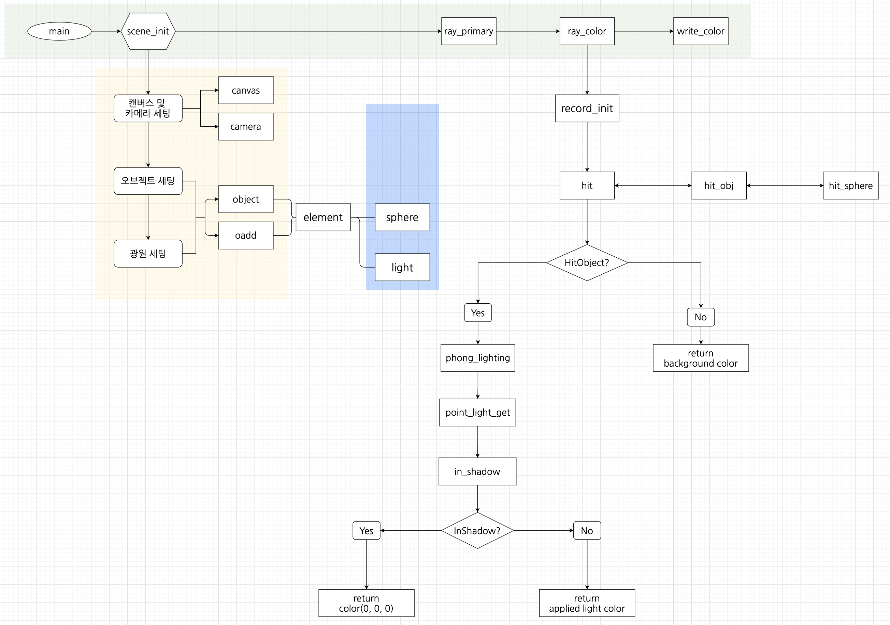

# 0. overview

## 0.1. 만든이들

kilee(이기훈) / hyeonkim(김형태) / mijeong(정민재)

## 0.2. 왜만들었는지

개발자의 길로 들어온지 반년차인 우리에게 ray tracing이라는 생소한 기술을 적용한 렌더링 프로그램을 만들어보는 실습은 짧은 개발자 인생에서 겪게된 가장 높은 벽이였다. 특히 우리가 실습을 할 당시 기준으로 한글로 작성된 ray tracing 실습 레퍼런스가 전무했었고,  ray tracing 의 수학의 정석과, 개념원리 와 같은 두개의 사이트([Scratchpixels](https://www.scratchapixel.com/), [Raytracing in one weekend](https://raytracing.github.io/)) 는 모두 c++을 통해 실습이 구성되어있어, 영알못에  다룰줄 아는 언어라곤 c밖에 없고 그마저도 비루한 수준의 실력인 우리에게는 시작부터 좌절의 연속이였다.

하지만 최종적으로 우리가 만든 프로그램으로 아래와 같은 멋진 이미지를 생성할 수 있었다

앞서 언급한 우리가 실습을 진행하며 겪었던 좌절들을, 이 실습 교재의 독자들이 조금은 수월하게 넘어갈 수 있길 바라는 마음에서 이 교재를 작성하게 되었다.

## 0.3. 레이트레이싱이란?

이 글을 보는 여러분은 아마도 영화 아바타를 봤을 것이다. 아바타를 보지 않았다면 토이스토리라도. 이러한 사실적인 이미지를 만드는 과정을 렌더링이라고 한다. 렌더링 기법에는 다양한 기술들이 있는데, 우리의 교재 이름인 ray-tracing도 그러한 기술 중 하나이다. 레이트레이싱 기술 자체에 대한 설명은 좋은 레퍼런스가 많으니 여기서는 생략한다.

## 0.4. 뭘만들었는지

높은 수준의 레이트레이싱 프로그램을 구현하는데에는 꽤나 방대한 양의 이론적 배경 지식이 요구된다. 하지만 컴퓨터 그래픽스를 처음 접하는 사람들은 (우리가 그랬던 것처럼) 압도적인 양의 배경 지식에 좌절할 수 있다.

레이트레이싱 기술의 골자는 눈으로 들어오는 광선을 역추적하는 방식인데, 사실적인 이미지를 얻기 위해서는 물리법칙의 준수가 가장 중요하다. 그렇기에 상업용 프로그램들에서는 보다 정확한 물리법칙에 기반한 path-tracing 등의 알고리즘을 사용하지만, 교재에서는 입문자들이 레이트레이싱 기술의 핵심을 학습하는 것이 목적이기 때문에 단순하면서도 레이트레이싱의 원리를 쉽게 학습할 수 있는 phong lighting model을 사용한다.

또한 이 교재는 이론 중심의 설명보다는, 점진적인 개발 **실습**을 통해 단계별로 결과물을 확인할 수 있도록 작성했다.

컴퓨터 그래픽스에 대해 더 자세히 알고 싶다면 아래에 링크를 따라가 보는 것을 추천한다.

- [Khan academy](https://www.khanacademy.org/computing/pixar/rendering/rendering1/v/rendering-1) : 레이트레이싱의 수학적 기초에 대해 강의하는 동영상. 정말 기초 중의 기초.
- [scratchapixel](https://www.scratchapixel.com/) : 컴퓨터 그래픽 전반에 대한 이론을 자세하게 설명한 사이트. 혹시 벡터나 행렬이 익숙하지 않다면, Geometry파트를 꼭 읽어보기 바란다.
- [phong lighting model(Opengl)](https://learnopengl.com/Lighting/Basic-Lighting) : pixar에서 일하시는 굉장한 분이 만든 모델을 설명한 사이트. 우리는 이 사이트를 참고하여 이 교재를 작성했다.
- [ray tracing in one weekend](https://raytracing.github.io/books/RayTracingInOneWeekend.html) : path-tracing 방식을 이용하여 (진짜 레이트레이싱)구현하는 법에 대한 설명이 있는 사이트.

## 0.5. 주의사항

우리 교재는 실습 위주의 교재이므로 보다 정확한 이론에 대해서는 본인이 찾아서 공부하는 것을 추천한다. 교재를 보면서 개선이 필요한 부분은 git issue에 남겨주길 바란다.

## 0.6. 목차

### 기본

1. [rgb_ppm](./01.rgb_ppm.md)
2. [vector](./02.vector.md)
3. [카메라/캔버스](./03.ray_and_camera.md)
4. [구](./04.sphere.md)
5. [법선](./05.normal.md)
6. [히트 레코드](06.hit_record.md)
7. [오브젝트](07.object.md)
8. [퐁 렌더링](08.phong_lighting.md)
9. [그림자](09.hard_shadow.md)
10. [카메라 업그레이드] - 작성 예정
11. [도형들] - 작성 예정
12. [변환/ 회전] - 작성 예정

### 심화

- 평행 광원

- 텍스쳐 -  체크 / 레인보우 / 싸인 / UV_sphere
- 큐브
- 피라미드
- 실린더 뚜껑
- 안티얼라이어싱
- 멀티쓰레딩
- 콘
- 스카이박스
- 필터

### +α

+ 빛의 거리 감쇄.
+ 메테리얼 + 패스트레이싱

## 0.7. Blueprint

기본 파트(9 챕터)를 완료하면, 아래와 같은 흐름의 프로그램이 완성된다.

